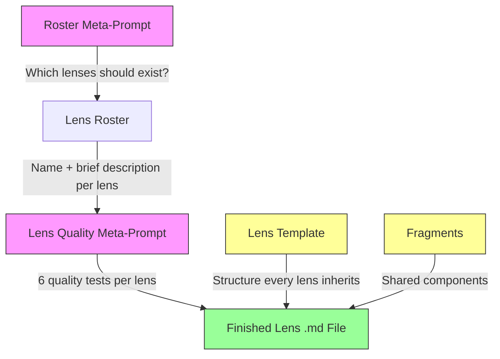
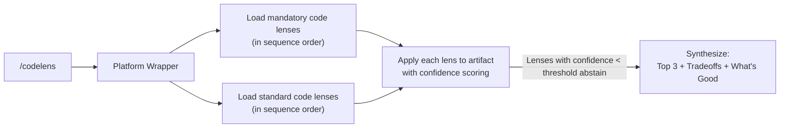

# prompt-lenses — Master Plan

## Vision

A personal library of high-quality, model-agnostic prompts ("lenses") for reviewing code and
documents through distinct cognitive perspectives. The core bet: investing heavily in prompt
quality produces compounding returns over years, across every AI platform. The models get
better, but better models with better prompts pull even further ahead.

---

## Architecture

### The Prompt Chain



**Layer 1 — Roster Design:** Meta-prompts that decide which lenses should exist.
Separate prompts for code and doc rosters, plus one for custom/novel artifact types.

**Layer 2 — Lens Quality:** A meta-prompt with 6 tests (Identity, Cognition, Novelty,
Chain, Anti-Padding, Concreteness) that ensures each individual lens changes HOW the
model thinks, not just WHAT it checks.

**Layer 3 — The Lenses:** The actual `.md` files. Each is a standalone prompt built on a
shared template, containing: a character identity, a core question, 4-6 thinking instructions,
confidence/relevance scoring, sequencing metadata, and composed from shared fragments.

### File Structure (Target)

```
prompt-lenses/
├── README.md
├── core/
│   ├── fragments/                  ← shared components composed into every lens
│   │   ├── output-format.md       ← severity ratings, fix requirements, confidence, anti-padding
│   │   ├── edge-cases.md          ← base edge-case handling for all lenses
│   │   └── synthesis.md           ← how to produce the cross-lens summary
│   ├── template/
│   │   └── lens-template.md       ← DONE (Phase 2.1)
│   ├── mandatory/
│   │   ├── security-code.md
│   │   ├── security-doc.md
│   │   ├── privacy-code.md
│   │   ├── privacy-doc.md
│   │   ├── testability-code.md
│   │   ├── testability-doc.md
│   │   ├── plain-language-code.md
│   │   ├── plain-language-doc.md
│   │   ├── failure-modes-code.md
│   │   ├── failure-modes-doc.md
│   │   └── connector-doc.md        ← doc-only mandatory (DD #28)
│   ├── standard/
│   │   ├── code/
│   │   │   ├── adversary.md
│   │   │   ├── newcomer.md
│   │   │   ├── time-traveler.md
│   │   │   ├── operator.md
│   │   │   ├── specification-lawyer.md
│   │   │   ├── deleter.md
│   │   │   ├── scientist.md
│   │   │   └── flow-analyst.md
│   │   └── doc/
│   │       ├── executive.md
│   │       ├── skeptic.md
│   │       ├── implementer.md
│   │       ├── outsider.md
│   │       ├── editor.md
│   │       ├── connector.md
│   │       └── consistency-checker.md
│   └── custom/
├── meta/
│   ├── roster-code.md
│   ├── roster-doc.md
│   ├── lens-selection.md           ← for custom/novel artifact types
│   ├── lens-quality.md             ← 6 quality tests for individual lenses
│   └── template-design.md          ← Skipped (see Meta-Prompts table)
├── platforms/
│   ├── claude/
│   │   ├── SKILL.md
│   │   └── README.md
│   ├── gemini/
│   │   └── README.md
│   ├── openai/
│   │   └── README.md
│   └── generic/
│       └── prompt-template.md
├── research/
│   ├── project1-landscape.md       ← DONE
│   ├── project2-prompt-anatomy.md  ← DONE
│   ├── prompts/
│   │   ├── research-prompt-project1.md
│   │   ├── research-prompt-anatomy.md
│   │   └── plan-prompt.md
│   └── evaluation/                 ← future promptfoo configs
│       └── README.md
└── scripts/
    └── assemble.py
```

### Runtime Flow



### Lens Sequencing (Macro to Micro)

From the professional editing stack and Six Thinking Hats research: lenses run in a defined
order. Structural/architectural lenses first, detail/style lenses last. No point polishing
code that the Deleter says should be removed.

**Code lens sequence (5 mandatory marked with *):**
1. Deleter (structural — is this worth keeping?)
2. Flow Analyst (structural — is the data architecture sound?)
3. \*Security (analytical — can this be exploited?)
4. \*Privacy (analytical — is data handled appropriately?)
5. \*Failure Modes (analytical — what happens when things go wrong?)
6. Operator (analytical — can this be run in production?)
7. Specification Lawyer (analytical — does it do what it says?)
8. \*Testability (detail — can we prove it works?)
9. Time Traveler (detail — will this age well?)
10. Newcomer (detail — can someone understand this?)
11. \*Plain Language (detail — are names and comments clear?)

**Doc lens sequence (6 mandatory marked with *):**
1. Executive (structural — does this have a point?)
2. \*Connector (structural — what's missing?)
3. Skeptic (analytical — is the reasoning sound?)
4. \*Security (analytical — are security implications addressed?)
5. \*Privacy (analytical — are privacy implications addressed?)
6. \*Testability (analytical — can this be built and verified?)
7. \*Failure Modes (analytical — what if this doesn't work?)
8. Outsider (detail — can someone read this cold?)
9. Consistency Checker (detail — does it agree with itself?)
10. Editor (detail — cut 40% with zero meaning loss)
11. \*Plain Language (detail — concrete nouns and vivid verbs)

---

## The Pipeline

### Phase 0: Infrastructure

- [ ] **0.1** Create the GitHub repo
  - Status: Not started
  - Depends on: Nothing
  - Output: Empty repo with directory structure

- [ ] **0.2** Create the repo README
  - Status: Not started
  - Depends on: 0.1
  - Output: `README.md`

- [ ] **0.3** Move existing meta-prompts and lens drafts into repo structure
  - Status: Not started
  - Depends on: 0.1
  - Output: `meta/` and `core/standard/` populated with current drafts

### Phase 1: Research — "What's already out there?"

- [x] **1.1** Run the landscape survey
  - Status: **DONE**
  - Output: `research/project1-landscape.md`

- [x] **1.2** Prompt anatomy research
  - Status: **DONE**
  - Output: `research/project2-prompt-anatomy.md`

#### Key Findings From Landscape Research (Project 1)

**Three structural changes to our system:**

1. **Confidence scoring / abstention.** Every lens should output a relevance score and be
   able to say "nothing material here" instead of padding. This must be baked into the lens
   template, not added per-lens. (Source: AI Council, CodeRabbit's verification agent)

2. **Macro-to-micro sequencing.** Lenses are not unordered. Structural lenses run before
   detail lenses. The Deleter runs before the Newcomer — no point making dead code readable.
   (Source: Professional editing stack, Six Thinking Hats)

3. **Fragment pattern.** Lenses share components (anti-padding instruction, output format,
   severity ratings, "show the fix" requirement). These should be fragments composed into
   each lens, not copy-pasted. (Source: thibaultyou/prompt-library)

**Two validations:**
- Nobody has a model-agnostic, multi-perspective lens library with a meta-prompt quality layer
- Nobody has encoded the professional editing stack as AI prompts

**One concern to monitor:**
- DSPy's "compile, don't write" philosophy could eventually make static prompt libraries
  obsolete. Mitigate by designing lenses that can be both hand-crafted and machine-optimized.

**Tools to integrate later:**
- promptfoo for evaluation (define test cases per lens, run across models, track regressions)
- GEPA for reflective prompt optimization (after we have evaluation data)

#### Key Findings From Prompt Anatomy Research (Project 2)

**The 8-element skeleton** (converges across leaked production prompts, academic research,
and practitioner wisdom):

Identity → Constraints/Scope → Context → Methodology → Output Format → Examples → Edge Cases → Closing Anchor

This is the structural backbone every lens should follow. Our existing lens drafts had
roughly the first five; the research revealed three missing elements and one structural
separation we weren't making.

**Three additions our lenses were missing:**

1. **Explicit out-of-scope declaration per lens.** Prevents scope creep between lenses. When
   the Security lens knows it should NOT opine on naming conventions, it doesn't. Without
   explicit scope boundaries, lenses bleed into each other and produce redundant findings.
   (Source: Cursor's constraints section)

2. **Edge cases & calibration section.** What to do when the artifact is perfect, when a
   finding is uncertain, how to calibrate severity. This is the #1 differentiator between
   amateur and production prompts. Production prompts like Cursor and Claude Code all have
   extensive edge case handling; hobbyist prompts almost never do.

3. **Closing anchor.** Restate the single most important principle at the end of every lens.
   Exploits the U-shaped attention curve from "Lost in the Middle" research — models attend
   most to the beginning and end of a prompt. Anthropic reported a 30% improvement when
   critical instructions appear at both the start and end.

**One structural change:**

Separate **Criteria** (what to look for) from **Methodology** (how to think about it). Our
current lenses blend "what" and "how" into a single thinking-instructions block. The research
shows that production prompts like Cursor and v0 separate these, and it improves clarity. For
our lenses, this means: Criteria is the checklist of concerns; Methodology is the cognitive
mode instruction (how to reason about those concerns). The Methodology section is our key
differentiator — it's what makes a lens a cognitive mode, not just a checklist.

**Formatting decision:**

XML tags for section boundaries, markdown inside. This hybrid is the de facto standard across
Claude and GPT. Model-agnostic safe choice. Anthropic trained Claude on XML tags; Cursor
validated the same approach works on GPT-4.1 and GPT-5.

**Anti-patterns to encode in our meta-prompts:**
- No vague role inflation ("world's most brilliant expert") — perspective, not inflation
- Prefer positive framing over negative ("do X" not "don't do Y") — except for critical
  safety/scope constraints
- No kitchen-sink monolithic prompts — separation of concerns
- Edge case handling is mandatory, not optional

### ~~Phase 2: Learn~~ — Folded Into Plan Update

The research was concrete enough that the takeaways are captured above. No separate
"Learn" project needed.

### Phase 2: Design the Lens Template — "What IS a lens, structurally?"

NEW phase added based on research. Before deciding which lenses to have, we need to design
what every lens looks like. This is the skeleton all mandatory and standard lenses inherit.

- [x] **2.1** Design the lens template
  - Status: **DONE**
  - Depends on: 1.1, 1.2 (research findings from both projects)
  - Output: `core/template/lens-template.md`
  - The template follows the 8-element skeleton from prompt anatomy research:
    1. **Identity** (Required) — 2-4 sentences establishing perspective, not inflation
    2. **Mission & Scope** (Required) — the lens's focus + explicit `out_of_scope` declaration
    3. **Evaluation Criteria** (Required) — what to look for, grouped by category
    4. **Methodology** (Required) — how to think; the cognitive mode instruction (our differentiator)
    5. **Output Format** (Required) — exact shape of desired output
    6. **Examples** (Recommended) — 1-2 concrete input/output pairs
    7. **Edge Cases & Calibration** (Required) — uncertainty handling, perfect artifacts, severity calibration
    8. **Closing Anchor** (Required) — restate the single most important principle
  - Structural notes:
    - XML tags for section boundaries, markdown inside
    - Criteria and Methodology are separate sections (not blended)
    - Confidence/relevance scoring lives in Output Format
    - Sequencing metadata (structural / analytical / detail) lives in YAML front-matter
  - Also delivered: quality checklist (Section D), completed security-code example (Section E),
    anti-pattern reference (Section F), fragment reference table (Section B)
  - **Note from Phase 2.2 dogfooding:** The Security-Code example needs a third scenario:
    high-relevance, no-findings (e.g., Security lens reviewing well-secured code). The missing
    "clean report" path was the #1 gap found during dogfooding. Can be added during Phase 4.1.

- [x] **2.2** Design shared fragments
  - Status: **DONE**
  - Depends on: 2.1
  - Output: `core/fragments/` populated
  - Fragments built (3 files — see Design Decision #26 for consolidation rationale):
    1. **output-format.md** — Finding structure (severity/title/location/issue/recommendation),
       severity scale (critical/major/minor/note), "show the fix" requirement, confidence
       scoring (per-finding confidence + overall lens relevance score), anti-padding instruction,
       abstention format when relevance is below threshold. Anti-padding and confidence-scoring
       content is inlined here (not separate files).
    2. **edge-cases.md** — Base edge-case handling: artifact too short/incomplete, no issues
       found (clean report permission), uncertain findings (flag confidence), general severity
       calibration principles
    3. **synthesis.md** — Used by platform wrapper, not individual lenses. Cross-lens summary:
       top 3 findings across all lenses, inter-lens tradeoff identification, "what's actually
       good" section. Flagged for re-validation during Phase 4.1.

- [ ] **2.3** ~~Write the meta-prompt for template design~~
  - Status: Skipped — template was designed directly from research inputs rather than via
    meta-prompt. The template itself (Phase 2.1) includes sufficient design rationale and a
    quality checklist that serves the same purpose.

### Phase 3: Decide — "What are the mandatory lenses?"

**Notes from Phase 2.2 dogfooding:**
- Mandatory lens scope boundaries should be designed as a set, not independently. Each
  lens's `<out_of_scope>` should reference the other mandatory lenses by name to prevent
  inter-lens overlap.
- Evaluate the Connector for mandatory status — its "what's missing?" cognitive mode caught
  a class of failures no other lens found during plan dogfooding.
- The Testability lens's "falsifiable check" standard was the highest-ROI transformation
  when applied to this plan. Strengthens the case for Testability as mandatory.

- [x] **3.1** Finalize mandatory lens roster for code
  - Status: **DONE**
  - Depends on: 2.1 (need the template to know what a lens contains)
  - Output: `docs/decisions/0001-mandatory-code-roster.md`
  - Result: 5 mandatory code lenses — Security, Privacy, Testability, Plain Language,
    Failure Modes

- [x] **3.2** Finalize mandatory lens roster for docs
  - Status: **DONE**
  - Depends on: 2.1
  - Output: `docs/decisions/0002-mandatory-doc-roster.md`
  - Result: 6 mandatory doc lenses — Security, Privacy, Testability, Plain Language,
    Failure Modes, Connector

- [x] **3.3** Decide if any mandatory lenses should be added or cut
  - Status: **DONE**
  - Depends on: 3.1, 3.2
  - Output: Updated rosters with justification (see DD #28, #29, #30)
  - Result: Connector added as mandatory for docs only. Bug Finder, Smooth Handoff, Toil
    Detector evaluated and deferred to Phase 5 as standard lenses. Adversary/Security,
    Editor/Plain Language, Operator/Failure Modes stay separate with explicit scope boundaries.

- [x] **3.4** Define sequencing for mandatory + standard lenses
  - Status: **DONE**
  - Depends on: 3.1, 3.2
  - Output: Sequencing tables updated above; roster documents record per-lens positions

### Phase 4: Build Mandatory Lenses — "Make each one excellent"

Each lens in Phase 4 is built by following this process (derived from the template):
1. Fill in the template (Identity, Mission & Scope, Criteria, Methodology)
2. Compose in fragments (output-format, edge-cases)
3. Add lens-specific edge cases and output requirements
4. Write 1–2 examples (one with findings, one showing abstention)
5. Write the closing anchor
6. Run the quality checklist (Section D of `core/template/lens-template.md`)
7. Human sign-off

- [ ] **4.1** Build security-code.md
  - Status: Not started
  - Depends on: 2.1, 2.2, 3.1
  - Output: `core/mandatory/security-code.md`

- [ ] **4.2** Build security-doc.md
  - Status: Not started
  - Depends on: 2.1, 2.2, 3.2
  - Output: `core/mandatory/security-doc.md`

- [ ] **4.3** Build privacy-code.md
  - Status: Not started
  - Depends on: 2.1, 2.2, 3.1
  - Output: `core/mandatory/privacy-code.md`

- [ ] **4.4** Build privacy-doc.md
  - Status: Not started
  - Depends on: 2.1, 2.2, 3.2
  - Output: `core/mandatory/privacy-doc.md`

- [ ] **4.5** Build testability-code.md
  - Status: Not started
  - Depends on: 2.1, 2.2, 3.1
  - Output: `core/mandatory/testability-code.md`

- [ ] **4.6** Build testability-doc.md
  - Status: Not started
  - Depends on: 2.1, 2.2, 3.2
  - Output: `core/mandatory/testability-doc.md`

- [ ] **4.7** Build plain-language-code.md
  - Status: Not started
  - Depends on: 2.1, 2.2, 3.1
  - Output: `core/mandatory/plain-language-code.md`

- [ ] **4.8** Build plain-language-doc.md
  - Status: Not started
  - Depends on: 2.1, 2.2, 3.2
  - Output: `core/mandatory/plain-language-doc.md`

- [ ] **4.9** Build failure-modes-code.md
  - Status: Not started
  - Depends on: 2.1, 2.2, 3.1
  - Output: `core/mandatory/failure-modes-code.md`

- [ ] **4.10** Build failure-modes-doc.md
  - Status: Not started
  - Depends on: 2.1, 2.2, 3.2
  - Output: `core/mandatory/failure-modes-doc.md`

- [ ] **4.11** Build connector-doc.md
  - Status: Not started
  - Depends on: 2.1, 2.2, 3.2
  - Output: `core/mandatory/connector-doc.md`
  - Notes: Doc-only mandatory lens. No code variant — see DD #28.

### Phase 5: Standard Lenses

- [ ] **5.1** Evaluate existing 8 code lenses against research findings
  - Status: Not started
  - Depends on: 1.1, 1.2, 4.x (mandatory lenses set the quality bar)
  - Output: Keep/revise/cut decisions for each
  - Key questions from research:
    - Do any standard lenses overlap with the new mandatory lenses?
    - Should the Adversary be merged with mandatory Security, or stay separate?
    - Does the Operator overlap with mandatory Failure Modes?

- [ ] **5.2** Evaluate existing 7 doc lenses against research findings
  - Status: Not started
  - Depends on: 1.1, 1.2, 4.x
  - Output: Keep/revise/cut decisions for each
  - Key questions from research:
    - Should the Editor be merged with mandatory Plain Language?
    - Does the Skeptic overlap with mandatory Testability (verifiability)?
    - Should we add an editing-stack lens (developmental editing)?

- [ ] **5.3** Revise or rebuild standard code lenses on the new template
  - Status: Not started
  - Depends on: 2.1, 2.2, 5.1
  - Output: `core/standard/code/` populated

- [ ] **5.4** Revise or rebuild standard doc lenses on the new template
  - Status: Not started
  - Depends on: 2.1, 2.2, 5.2
  - Output: `core/standard/doc/` populated

### Phase 6: Platform Wrappers

- [ ] **6.1** Build Claude skill wrapper
  - Status: Draft exists from initial conversation
  - Depends on: 4.x, 5.x (needs to know what to load and in what order)
  - Output: `platforms/claude/SKILL.md`
  - Must handle: sequencing, confidence-based abstention, fragment composition

- [ ] **6.2** Build Gemini Gem wrapper (or equivalent)
  - Status: Not started
  - Depends on: 4.x, 5.x
  - Output: `platforms/gemini/`

- [ ] **6.3** Build generic copy-paste template
  - Status: Not started
  - Depends on: 4.x, 5.x
  - Output: `platforms/generic/prompt-template.md`

- [ ] **6.4** Optional: Build assemble.py
  - Status: Not started
  - Depends on: 6.1, 6.2, 6.3
  - Output: `scripts/assemble.py`
  - Notes: Inlines fragments and composes lenses into self-contained platform packages

### Phase 7: Evaluation (Future)

- [ ] **7.1** Set up promptfoo for lens evaluation
  - Status: Not started
  - Depends on: 4.x (need lenses to test)
  - Output: `research/evaluation/` with YAML configs per lens

- [ ] **7.2** Define test cases per lens (input artifact + expected findings)
  - Status: Not started
  - Depends on: 7.1

- [ ] **7.3** Run cross-model evaluation (Claude, Gemini, GPT)
  - Status: Not started
  - Depends on: 7.2

- [ ] **7.4** Consider GEPA for reflective lens optimization
  - Status: Not started
  - Depends on: 7.3 (need evaluation data first)

### Phase 8: Meta-Prompt Maintenance

- [ ] **8.1** Update meta-prompts to incorporate research findings
  - Status: Not started
  - Depends on: 1.1, 1.2
  - Output: Revised files in `meta/`
  - Changes needed:
    - Add confidence scoring requirement to lens-quality.md
    - Add sequencing metadata to roster meta-prompts
    - Add fragment composition to template design
    - Update lens-quality.md to check for the 8-element skeleton, not just the current 6 quality tests
    - Roster meta-prompts need to validate that each lens includes: Identity, Mission & Scope (with out-of-scope), Criteria, Methodology, Output Format, Edge Cases, and Closing Anchor
    - Add anti-pattern checks: no role inflation, positive framing, separation of concerns

---

## Critical Path

```
Research (done) → Template Design (2.1 done, 2.2 done) → Decide Rosters (3.x done) → Build Mandatory (4.x next) → Standard Lenses (5.x) → Wrappers (6.x)
```

Phase 0 (repo setup) can happen anytime.
Phase 7 (evaluation) can start as soon as Phase 4 produces lenses.
Phase 8 (meta-prompt updates) can happen in parallel with Phases 2-4.

---

## Existing Meta-Prompts

| File | Purpose | Status |
|------|---------|--------|
| `meta-prompt-code-roster.md` | Designs the standard code lens lineup | Done (draft, needs research updates + 8-element skeleton check) |
| `meta-prompt-doc-roster.md` | Designs the standard doc lens lineup | Done (draft, needs research updates + 8-element skeleton check) |
| `meta-prompt-lens-selection.md` | Designs custom lens sets for novel artifact types | Done (draft) |
| `meta-prompt.md` | Ensures individual lens quality (6 tests) | Done (draft, needs confidence scoring + 8-element skeleton validation) |
| `research-prompt-project1.md` | The landscape research survey | Done, run, complete |
| `research-prompt-anatomy.md` | The prompt anatomy structural research | Done, run, complete |
| `plan-prompt.md` | Generates this plan document | Done, run |
| `meta/template-design.md` | Designs the lens template structure | Skipped — template was designed directly from research inputs rather than via meta-prompt |

---

## Design Decisions Made

1. **Lenses are cognitive modes, not checklists.** Each lens must change HOW the model thinks.

2. **Each lens gets its own .md file.** No grouping. Independently excellent, independently updatable.

3. **Mandatory lenses are split into -code.md and -doc.md variants.** Same principle, different
   cognitive mode. Different thinking instructions.

4. **Core lenses are model-agnostic.** No platform-specific formatting. Platform stuff lives
   in thin wrappers.

5. **Mandatory lenses: 5 for code, 6 for docs.** Code: Security, Privacy, Testability, Plain
   Language, Failure Modes. Docs: same 5 plus Connector. See DD #28 for rationale.

6. **Plain Language emphasizes "concrete nouns and vivid verbs."** From The Economist writing
   course. Specific phrasing, not generic "clear language."

7. **User applies ALL suggestions, not just top 3.** Anti-padding is critical.

8. **Quality over speed.** No concern about lens run time or generation time.

9. **Separate logic from interface.** core/ is the intellectual property. platforms/ is disposable.

10. **Start from failure modes, not lens names.** Enumerate how artifacts fail, then cluster
    into cognitive modes.

11. **Lenses run in macro-to-micro sequence.** Structural/architectural lenses before
    detail/style lenses. (From research: professional editing stack)

12. **Every lens has confidence scoring.** Lenses assess their own relevance and abstain when
    below threshold. No padding, ever. (From research: AI Council)

13. **Shared components are fragments, not copy-paste.** Output format, anti-padding rules,
    severity ratings, and synthesis instructions are composed into lenses from reusable
    fragments. (From research: thibaultyou/prompt-library)

14. **Tradeoff identification in synthesis.** When lenses disagree, that's the most valuable
    finding. The synthesis step explicitly identifies inter-lens tensions.
    (From research: ATAM)

15. **Lens template follows the 8-element skeleton:** Identity → Mission & Scope → Criteria →
    Methodology → Output Format → Examples → Edge Cases → Closing Anchor. (From research:
    converges across leaked production prompts, academic research, and practitioner wisdom)

16. **Criteria and Methodology are separate sections.** Criteria = what to look for.
    Methodology = how to think. Our current lenses blend these; the new template separates them.
    (From research: production prompts like Cursor and v0 separate "what" from "how")

17. **XML tags for section boundaries, markdown for internal structure.** This hybrid is the
    model-agnostic standard. (From research: Anthropic trained Claude on XML; Cursor validated
    same approach on GPT-4.1/5)

18. **Every lens has an explicit out-of-scope declaration** to prevent scope creep between
    lenses. (From research: Cursor's constraints section)

19. **Every lens has edge case handling:** what to do when the artifact is perfect, when
    findings are uncertain, severity calibration. This is required, not optional.
    (From research: #1 differentiator between amateur and production prompts)

20. **Closing anchor restates the single most important principle** at the end of every lens.
    (From research: "Lost in the Middle" U-shaped attention, Anthropic 30% improvement)

21. **Prefer positive framing.** "Do X" not "Don't do Y" — except for critical safety/scope
    constraints. (From research: Anthropic's Zack Witten warned negative instructions can
    backfire)

22. **Criteria vs. Methodology uses Option A** — Criteria is WHAT (observable things to look
    for, grouped by category), Methodology is HOW (cognitive steps, analytical process).
    Validated by the "swap test": could you change the Methodology and keep the same Criteria?
    If yes, they're properly separated. (From template: Phase 2.1)

23. **Confidence scoring lives in the output-format fragment.** Two levels: per-finding
    confidence (high/medium/low) and overall lens relevance (0.0–1.0). Abstention threshold:
    relevance < 0.3 produces a one-line abstention instead of a full report. (From template:
    Phase 2.1)

24. **Sequencing metadata is YAML front-matter** with `sequence_phase` (structural /
    analytical / detail) and `sequence_position` (integer for fine ordering within phase).
    (From template: Phase 2.1)

25. **Fragment composition is inline assembly** — at build time, every `{{fragment:name}}`
    marker is replaced with the literal contents of the fragment file. The assembled lens is
    self-contained with no runtime references. (From template: Phase 2.1)

26. **3 fragment files, not 5.** Anti-padding and confidence-scoring are inlined into
    `output-format.md` rather than existing as standalone fragments. Rationale: the build
    script replaces fragments one level deep — nesting fragments inside fragments would
    require two-pass assembly that isn't worth building for a few sentences. Anti-padding
    and confidence-scoring define parts of the output structure and belong with it.
    Reversal trigger: re-evaluate during Phase 8.1 if `meta/lens-quality.md` needs to
    reference anti-padding or confidence-scoring independently. (From Phase 2.2)

27. **Inter-lens tradeoffs use simple flagging, not structured debate.** When lenses produce
    contradictory recommendations, the synthesis fragment surfaces the tension explicitly
    with a concrete example format (Lens A recommends X, Lens B recommends Y, they conflict
    because Z). No back-and-forth debate protocol. (From Phase 2.2, resolves open question
    at former line 628)

28. **Connector is mandatory for docs, not code.** The "what's missing?" cognitive mode caught
    a class of structural failures no other lens found during Phase 2.2 dogfooding — missing
    links between sections, absent prerequisites, logical sequencing gaps. No equivalent gap
    exists in the code lens set, where Flow Analyst and Deleter cover structural concerns.
    This makes the mandatory set asymmetric (5 code, 6 doc). The cognitive needs differ by
    domain. (From Phase 3)

29. **Standard lenses with mandatory overlap stay separate with explicit scope boundaries.**
    Adversary/Security, Editor/Plain Language, and Operator/Failure Modes are genuinely
    different cognitive modes — creative attack narrative vs systematic control checking,
    structural cutting vs lexical clarity, 3AM incident simulation vs abstract failure mapping.
    The template's `<out_of_scope>` mechanism handles overlap: each standard lens's out-of-scope
    references the mandatory lens it's most likely confused with. (From Phase 3)

30. **Bug Finder, Smooth Handoff, and Toil Detector are standard lenses.** All three were
    evaluated for mandatory status during Phase 3. Bug Finder's "trace execution" mode is
    distinct but not universal. Smooth Handoff is distinct but niche. Toil Detector is
    genuinely novel but not universal enough. Evaluation of where they fit in the standard
    set is deferred to Phase 5. (From Phase 3)

---

## Open Questions

- [ ] "What's good" sourcing — Do lenses each include a brief "strengths" note, or does
  synthesis analyze the artifact independently for strengths? (Resolve during Phase 3 or 4.)
- [x] ~~Final mandatory lens count — 5 is current, Phase 3 may add or cut~~ Resolved: 5 code,
  6 doc (Connector added for docs only). See DD #28.
- [ ] Whether standard lenses need the same per-file treatment as mandatory
- [x] ~~How to handle lenses that might be mandatory for code but not docs (or vice versa)~~
  Resolved: asymmetric sets are fine. Connector is doc-only mandatory. See DD #28.
- [ ] Versioning strategy — do we track lens changes over time? Changelogs?
- [ ] Depth parameter — mandatory-only quick mode vs. full battery?
- [ ] How custom/project-specific lenses relate to the standard set at runtime
- [x] ~~Whether the Adversary should merge into mandatory Security or stay separate~~ Resolved:
  stay separate. Different cognitive modes (creative attack narrative vs systematic analysis).
  See DD #29.
- [x] ~~Whether the Editor should merge into mandatory Plain Language or stay separate~~ Resolved:
  stay separate. Different cognitive levels (structural cutting vs lexical clarity). See DD #29.
- [x] ~~Whether the Operator should merge into mandatory Failure Modes or stay separate~~ Resolved:
  stay separate. Different cognitive modes (3AM incident simulation vs abstract failure mapping).
  See DD #29.
- [ ] promptfoo integration timeline — before or after initial lens build?
- [ ] Whether assemble.py is worth building or manual sync is fine
- [x] ~~How to handle inter-lens tensions (structured debate? simple flagging?)~~ Resolved:
  simple flagging. See Design Decision #27.
- [ ] Should lenses be able to reference findings from earlier lenses in the sequence?
- [ ] Should examples be required or recommended? Research says recommended, but for lenses
  with non-obvious output expectations they may be critical.
- [ ] Estimated lens length: 1,000-2,000 tokens for standard lenses. Is this compatible with
  running 10+ lenses in a single review? Context window budget matters.
- [x] ~~Should anti-padding and confidence-scoring be standalone fragments or inlined into
  output-format?~~ Resolved: inlined. See Design Decision #26.
- [ ] The template specifies 1,000-2,000 tokens for standard lenses, up to 4,000 for complex.
  Do the fragments add significantly to this budget? Need to measure once fragments exist.
- [ ] The Quality Checklist in the template (Section D) — should this be extracted into a
  standalone file that the lens-quality meta-prompt references?
- [x] ~~Lens candidates: Bug Finder, Smooth Handoff, Toil Detector~~ Resolved: all three are
  standard lenses, not mandatory. Evaluation of where they fit in the standard set deferred
  to Phase 5. See DD #30.

---

## Principles

1. **Prompts are the product.** They compound over time.
2. **Separate logic from interface.** core/ never mentions a platform.
3. **Each lens must change HOW the model thinks,** not just WHAT it checks.
4. **Start from failure modes,** not from brainstorming lens names.
5. **Fewer, deeper lenses** beat more, shallower lenses.
6. **No padding.** If a lens finds nothing, it abstains with a confidence score.
7. **Concrete nouns and vivid verbs.** In the lenses themselves, and in everything they review.
8. **Macro to micro.** Structural before detail. Architecture before style.
9. **Compose, don't copy-paste.** Shared components are fragments.
10. **Tradeoffs are the best findings.** When lenses disagree, surface it.

---

*Last updated: Feb 25, 2026 (Phase 3 complete). This document is the single source of truth for the prompt-lenses project.*
